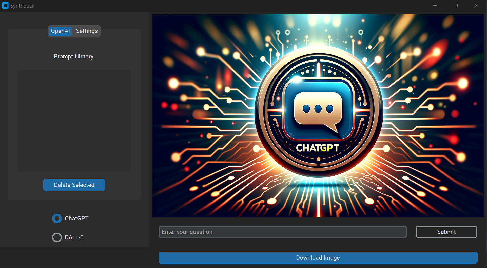
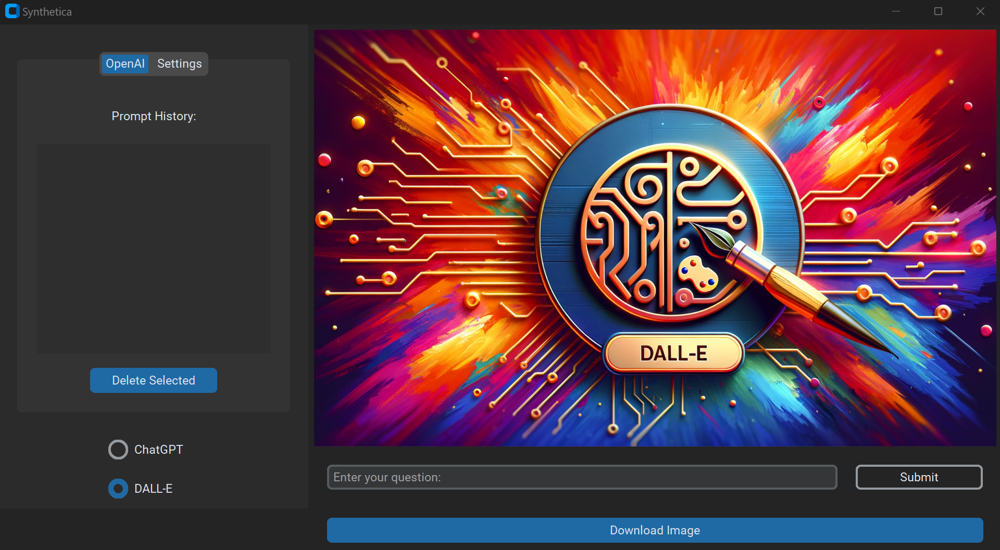

# Synthetica

## Overview

Synthetica is a GUI-based application designed to interact with OpenAI's GPT and DALL-E models, providing users with the ability to generate text and image responses to prompts. It features a modern interface, history management of prompts, and secure credential handling for API interactions.
- ChatGPT


  
- DALL-E


## Features

- Generate text responses from ChatGPT.
- Generate images from DALL-E.
- Manage and store prompt history.
- Securely store and manage OpenAI API credentials.
- Dark and light mode for the application interface.

## Prerequisites

Before you begin, ensure you have met the following requirements:

- Python 3.10 installed on your system.
- `pip` for installing dependencies.
- An OpenAI API key and organization ID.

## Installation

To install Synthetica, follow these steps:

1. Clone the repository to your local machine:
   ```sh
   git clone [repository URL]
   ```
   
2. Install the required dependencies:
   ```sh
   pip install -r requirements.txt
   ```
## Usage

To start using Synthetica, you need to follow these steps:
1. Run the main.py script to start the application
2. Navigate to the 'Settings' tab to enter your OpenAI API credentials.
3. Use the 'ChatGPT' tab to enter a prompt and receive a text response.
4. Use the 'DALL-E' tab to enter a prompt and receive an image response.
5. View and manage your prompt history within the application.
6. Use the appearance mode selector to switch between dark and light modes.

## Project Structure

- api: Contains the openai_interface.py module for interfacing with the OpenAI API.
- app.log: A log file where application logs are stored.
- AppBackUp.py: A bbackup of main application script.
- assets: Holds static assets like images used in the GUI.
- database: Includes db_manager.py which handles database operations.
- gui: Contains app.py which is the main GUI script.
- LICENSE.txt: The license file for project.
- main.py: The entry point script for application.
- notebooks: Contains Jupyter notebooks, used for prototyping or testing (SandBox.ipynb).
- requirements.txt: A file listing the Python dependencies required for project.
- splash.py: "Work in progress" - A script for a splash screen shown when the application starts.
- synt.db: The SQLite database file used by the application.
- tools.py: Contains utility functions for the app.

```Synthetica
├── api
│   ├── openai_interface.py
│   ├── __init__.py
│   └── __pycache__
├── app.log
├── assets
│   ├── ChatGpt.png
│   └── Dalle.png
├── database
│   ├── db_manager.py
│   ├── __init__.py
│   └── __pycache__
├── gui
│   ├── app.py
│   ├── __init__.py
│   └── __pycache__
├── LICENSE.txt
├── main.py
├── notebooks
│   └── SandBox.ipynb
├── README.md
├── requirements.txt
├── splash.py
├── synt.db
├── tests
│   ├── test_api.py
│   ├── test_db_manager.py
│   └── test_gui.py
├── tools.py 
```

## Contributing to Synthetica
To contribute to Synthetica, follow these steps:
1. Fork this repository.
2. Create a branch: git checkout -b [branch_name].
3. Make your changes and commit them: git commit -m '[commit_message]'.
4. Push to the original branch: git push origin [project_name]/[location].
5. Create the pull request.

Alternatively, see the GitHub documentation on creating a pull request


## License

This project is licensed under the MIT License. See the [LICENSE](LICENSE.txt) file for details.

## Acknowledgments
 - All models used within API are provided by [OpenAI](https://openai.com/).